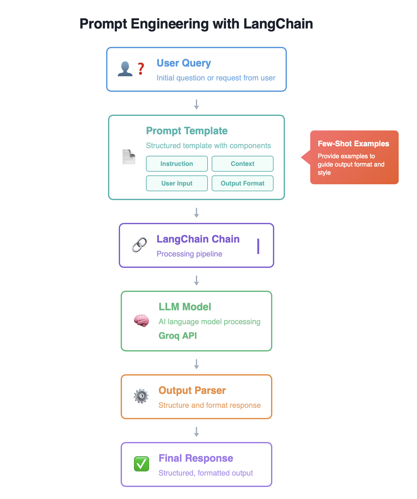

[](https://github.com/neuefische/ds-prompt-engineering/actions/workflows/workflow-02.yml)
## Prompt Engineering with LangChain

### Introduction

**Prompt engineering** is the practice of designing and refining inputs (prompts) to guide Large Language Models (LLMs) toward producing desired outputs. Well-crafted prompts can dramatically improve the quality, accuracy, and relevance of AI-generated responses.

**Why is prompt engineering important?**
- **Control and precision**: Direct the model to produce specific formats, tones, or types of responses
- **Better results with less effort**: Get accurate answers without fine-tuning or training custom models
- **Cost-effective**: Optimize model performance using existing pre-trained models
- **Flexibility**: Quickly adapt model behavior for different use cases

**When to use prompt engineering:**
- Building chatbots, virtual assistants, or conversational interfaces
- Creating content generation systems (documentation, FAQs, summaries)
- Extracting structured information from unstructured text
- Building Retrieval-Augmented Generation (RAG) systems
- Prototyping AI applications before investing in custom model training

This workshop teaches you practical prompt engineering techniques using the **LangChain** framework—a popular Python library for building LLM applications—with Groq's free LLM API through hands-on exercises.



**Understanding the Workflow:**

1. **User Input/Query** - Your question or request
2. **Prompt Template** - Structures input with four components:
   - **Instruction**: What the model should do
   - **External Context**: Additional knowledge from documents or databases (source knowledge vs. parametric knowledge)
   - **User Input**: Query dynamically inserted via variables like `{question}`
   - **Output Indicator**: Guides response format (e.g., "Answer:", structured formatting)
3. **Few-Shot Examples** - Example input-output pairs that teach the model your desired format
4. **LangChain Chain** - Components piped together: `prompt_template | llm | output_parser`
5. **LLM (Groq API)** - Model (`llama3-8b-8192`) processes the prompt with configurable parameters (`temperature`, `max_tokens`)
6. **Output Parser** - Formats raw responses into usable structures
7. **Final Response** - Polished output for your application

This workflow controls LLM behavior without retraining, enabling production-quality results from general-purpose models.

### Workshop Structure

Work through these two Jupyter notebooks sequentially:

1. **[1_intro_langchain.ipynb](1_intro_langchain.ipynb)** - Introduction to LangChain
2. **[2_langchain_prompt_engineering.ipynb](2_langchain_prompt_engineering.ipynb)** - Prompt Engineering with LangChain

### What You'll Learn

**Notebook 1: LangChain Fundamentals**
- What LangChain is and its core components (prompts, LLMs, chains, tools, agents, memory)
- How to integrate LLMs (specifically Groq's API) with LangChain
- How to create prompt templates with dynamic input variables
- How to build chains by piping components together (`prompt | llm`)
- How to invoke chains for single and batch queries

**Notebook 2: Prompt Engineering Techniques**
- Applying the 4-part prompt structure in practice
- Context-based question answering with external knowledge
- Few-shot prompting with example input-output pairs
- Using `FewShotPromptTemplate` to structure examples systematically
- Chaining with output parsers for formatted responses

### Prerequisites

- Python 3.11.3 installed (via pyenv)
- Free Groq API key from [Groq Console](https://console.groq.com/playground)
- Basic understanding of Python and Jupyter notebooks

### Setup Instructions

**1. Get your Groq API key**
- Create a free account at [Groq Console](https://console.groq.com/playground)
- Generate your API key (no credit card required)

**2. Create `.env` file**

Create a `.env` file in the repository root with:

```
GROQ_API_KEY=<your groq api key>
```

**3. Set up your Python environment**

**macOS:**
```bash
pyenv local 3.11.3
python -m venv .venv
source .venv/bin/activate
pip install --upgrade pip
pip install -r requirements.txt
```

**Windows (PowerShell):**
```powershell
pyenv local 3.11.3
python -m venv .venv
.venv\Scripts\Activate.ps1
python -m pip install --upgrade pip
pip install -r requirements.txt
```

**Windows (Git Bash):**
```bash
pyenv local 3.11.3
python -m venv .venv
source .venv/Scripts/activate
python -m pip install --upgrade pip
pip install -r requirements.txt
```

---

## Real-World Applications

Prompt engineering makes AI applications more efficient and effective. Application developers typically encapsulate open-ended user input inside a prompt before passing it to the AI model.

For example, consider AI chatbots. A user may enter an incomplete problem statement like, "Where to purchase a shirt." Internally, the application's code uses an engineered prompt that says, "You are a sales assistant for a clothing company. A user, based in Alabama, United States, is asking you where to purchase a shirt. Respond with the three nearest store locations that currently stock a shirt." The chatbot then generates more relevant and accurate information. [AWS Prompt Engineering](https://aws.amazon.com/what-is/prompt-engineering/)

The prompt engineering techniques are actively used in production by major companies worldwide:

**Source: [LangGraph in Production](https://blog.langchain.com/is-langgraph-used-in-production/)**

- **Klarna**: AI customer support assistant serving 85 million active users, reducing customer resolution time by 80%
- **LinkedIn**: AI-powered recruiter automating candidate sourcing and SQL Bot that transforms natural language questions into SQL queries
- **Uber**: Automated unit test generation for large-scale code migrations using multi-agent systems
- **AppFolio**: AI copilot saving property managers 10+ hours per week with 2x improvement in decision accuracy

**Source: [Top LangGraph Agents in Production 2024](https://blog.langchain.com/top-5-langgraph-agents-in-production-2024/)**

- **Cisco Outshift**: AI Platform Engineer boosting developer productivity 10x, reducing CI/CD pipeline setup from one week to under one hour

**Source: [LangChain Use Cases - Airbyte](https://airbyte.com/data-engineering-resources/langchain-use-cases)**

- Organizations report LangChain pipelines shorten deployment by 3-5x and reduce manual data engineering tasks by up to 80%
- Used by 100,000+ companies worldwide for document Q&A, conversational AI, and automated knowledge systems

---

## Taking It Further: Project Ideas

After completing this workshop, you'll have the skills to build your own prompt engineering applications. Here are practical project ideas that apply what you've learned:

### 1. Job Application Assistant

Analyze job postings and extract structured information (skills, requirements, experience levels).

**Workflow:**
1. Paste job posting text
2. Extract requirements with prompt template
3. Categorize skills using few-shot examples
4. Generate cover letter outline via chained prompt

**Extensions:** Compare multiple postings, generate tailored resume bullets, create skills gap analysis

### 2. Content Transformation Pipeline

Convert content between formats (e.g., technical docs to beginner guides, meeting notes to action items).

**Workflow:**
1. Start with source content
2. Use few-shot examples for desired transformation
3. Build chain: `extraction_prompt | llm | formatting_prompt | llm | output_parser`
4. Batch process multiple documents

**Examples:** Meeting notes → action items, research papers → summaries, code docs → tutorials

### Getting Started

**Pick a project that solves a real problem you have.** Start simple:
1. Define your input and desired output clearly
2. Create a basic prompt template with the 4 components (instruction, context, input variable, output indicator)
3. Test with a few examples manually
4. Add few-shot examples if formatting is complex
5. Build chains if you need multi-step processing
6. Scale with batch processing

**Additional resources:**
- [LangChain Documentation](https://docs.langchain.com/oss/python/langchain/overview)
- [Prompt Engineering Guide](https://www.promptingguide.ai/)
- [LangChain GitHub Repository](https://github.com/langchain-ai/langchain)
